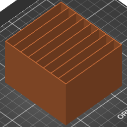

# Phone Organizer

This repository contains an OpenSCAD source code, STL, Prusa MK3S GCode and a
PrusaSlicer project (extracted 3MF) for a phone organizer model I made.

I use https://github.com/tomashubelbauer/3mf-zip-dir to extract the 3MF file to
a directory by the same name prior to every commit.
